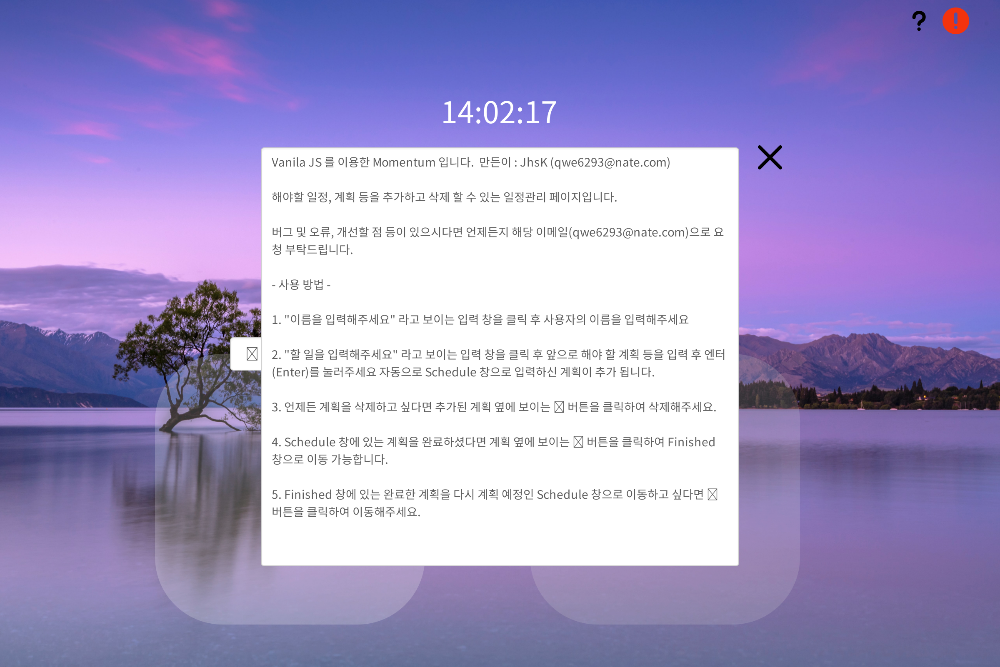
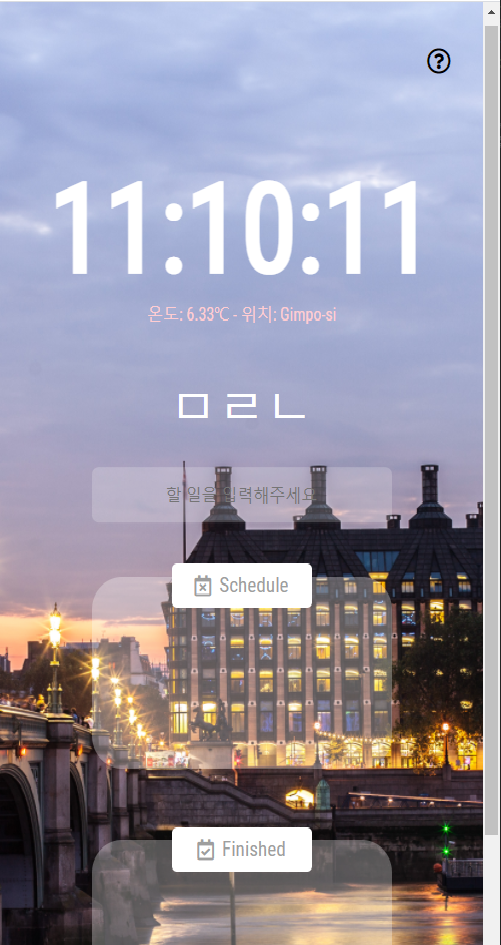

# JS-Momentum

## 바닐라 자바스크립트를 이용한 Momentum 입니다.

 

### 기능

- [x] 시계
- [x] 로컬 스토리지를 이용한 이름 입력 및 저장 유지 기능
- [x] 로컬 스토리지를 이용한 할 일 입력
- [x] 로컬 스토리지를 이용한 스케줄 관리 및 완료 구별 기능
- [x] 문의하기 버튼을 통한 버그 신고 및 사용설명 안내 기능
- [x] 반응형 적용
- [x] 배경화면 랜덤 생성 적용 기능

 

### 와이어프레임

 
메인화면

 

문의버튼 클릭 시

 

반응형 적용

